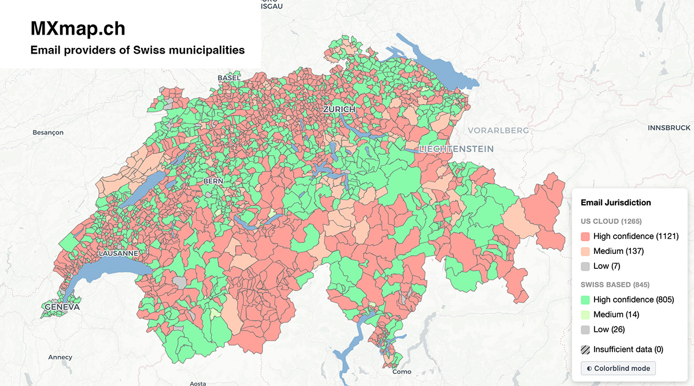
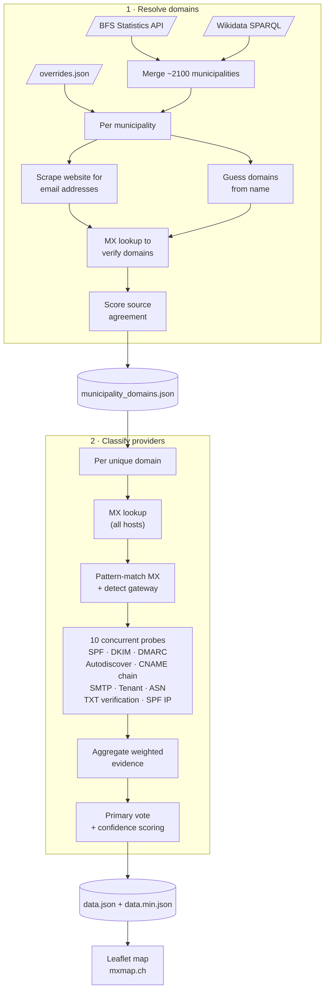

# MXmap — Email Providers of Swiss Municipalities

[](https://github.com/davidhuser/mxmap/actions/workflows/ci.yml)

An interactive map showing where Swiss municipalities host their email — whether with US hyperscalers (Microsoft, Google, AWS) or Swiss providers or other solutions.

**[View the live map](https://mxmap.ch)**

[](https://mxmap.ch)

## How it works

The data pipeline has two stages:

1. **Resolve domains** — Fetches all ~2100 Swiss municipalities from Wikidata and the BFS (Swiss Statistics) API, applies manual overrides, scrapes municipal websites for email addresses, guesses domains from municipality names, and verifies candidates with MX lookups. Scores source agreement to pick the best domain. Outputs `municipality_domains.json`.

2. **Classify providers** — For each resolved domain, looks up all MX hosts, pattern-matches them, then runs 10 concurrent probes (SPF, DKIM, DMARC, Autodiscover, CNAME chain, SMTP banner, Tenant, ASN, TXT verification, SPF IP). Aggregates weighted evidence, computes confidence scores (0–100). Outputs `data.json` (full) and `data.min.json` (minified for the frontend).



## Classification system

see [`classifier.py`](src/mail_sovereignty/classifier.py) for the full implementation details, but in summary,
we use a weighted evidence system where each probe contributes signals of varying strength towards different provider classifications.


## Quick start

```bash
uv sync

# Stage 1: resolve municipality domains
uv run resolve-domains

# Stage 2: classify email providers
uv run classify-providers

# Serve the map locally
python -m http.server
```

## Development

```bash
uv sync --group dev

# Run tests (90% coverage threshold enforced)
uv run pytest --cov --cov-report=term-missing

# Lint & format
uv run ruff check src tests
uv run ruff format src tests
```


## Related work

* [hpr4379 :: Mapping Municipalities' Digital Dependencies](https://hackerpublicradio.org/eps/hpr4379/index.html)
* If you know of other similar projects, please open an issue or submit a PR to add them here!

## Forks

* DE 
  * https://b42labs.github.io/mxmap/
  * https://mx-map.de/
* NL https://mxmap.nl/
* NO https://kommune-epost-norge.netlify.app/
* BE https://mxmap.be/
* EU https://livenson.github.io/mxmap/
* LV: https://securit.lv/mxmap
* [CAmap Nordic & Baltic](https://koldex.github.io/ca-sovereignty-map/) — TLS CA sovereignty for Nordic and Baltic municipalities ([source](https://github.com/koldex/ca-sovereignty-map))
* PT: https://mxmap.pt/
* FR: https://mxmairies.fr/
* See also the forks of this repository


## Contributing

If you spot a misclassification, please open an issue with the BFS number and the correct provider.
For municipalities where automated detection fails, corrections can be added to [`overrides.json`](overrides.json).

## Licence

[MIT](LICENCE)
