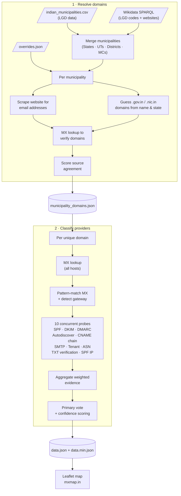

# MXmap — Email Providers of Indian Municipalities

[](https://github.com/jesbinjoseph/mxmap/actions/workflows/ci.yml)

An interactive map showing where Indian municipalities host their email — whether with US hyperscalers (Microsoft 365, Google Workspace, AWS) or India-based solutions (NIC, Indian ISPs, independent hosting).

**[View the live map](https://mxmap.in)**

[](https://mxmap.in)

> This is an India-specific fork of [davidhuser/mxmap](https://github.com/davidhuser/mxmap), adapted to cover Indian states, union territories, districts, and municipal corporations using the Local Government Directory (LGD).

## How it works

The data pipeline has two stages:

1. **Resolve domains** — Loads Indian municipalities from a curated `indian_municipalities.csv` (sourced from the Local Government Directory) and Wikidata SPARQL, applies manual overrides, scrapes municipal websites for email addresses, guesses `.gov.in` / `.nic.in` domains from municipality names and state abbreviations (ISO 3166-2:IN), and verifies candidates with MX lookups. Scores source agreement to pick the best domain. Outputs `municipality_domains.json`.

2. **Classify providers** — For each resolved domain, looks up all MX hosts, pattern-matches them, then runs 10 concurrent probes (SPF, DKIM, DMARC, Autodiscover, CNAME chain, SMTP banner, Tenant, ASN, TXT verification, SPF IP). Aggregates weighted evidence, computes confidence scores (0–100). Classifies each domain into one of: `microsoft`, `google`, `aws`, `nic`, `indian-isp`, or `independent`. Outputs `data.json` (full) and `data.min.json` (minified for the frontend).



## Provider categories

| Category | Providers |
|---|---|
| `us-cloud` | Microsoft 365, Google Workspace, AWS |
| `india-based` | NIC (National Informatics Centre), Indian ISPs, Independent/self-hosted |

## Municipality data

Municipalities are loaded from [`indian_municipalities.csv`](indian_municipalities.csv), which covers:

- **28 States** and **8 Union Territories**
- **Districts** across all states
- **Municipal Corporations (MC)** — major urban local bodies

Each entry carries an LGD code (Local Government Directory code), name, state, and entity type. The pipeline uses Indian state abbreviations (ISO 3166-2:IN) — e.g. `mh` for Maharashtra, `dl` for Delhi — to generate plausible `.gov.in` and `.nic.in` domain candidates.

## Classification system

See [`classifier.py`](src/mail_sovereignty/classifier.py) for the full implementation details, but in summary,
we use a weighted evidence system where each probe contributes signals of varying strength towards different provider classifications.

## Quick start

```bash
uv sync

# Stage 1: resolve municipality domains
uv run resolve-domains
# iGOD district enrichment is enabled by default; disable if needed
uv run resolve-domains --no-include-igod-districts

# Stage 2: classify email providers
uv run classify-providers

# Serve the map locally
python -m http.server
```

## Development

```bash
uv sync --group dev

# Run tests (90% coverage threshold enforced)
uv run pytest --cov --cov-report=term-missing

# Lint & format
uv run ruff check src tests
uv run ruff format src tests
```

## Related work

* [mxmap.ch](https://mxmap.ch) — the original Swiss version by David Huser
* [hpr4379 :: Mapping Municipalities' Digital Dependencies](https://hackerpublicradio.org/eps/hpr4379/index.html)

## Other country forks

* CH (original): https://mxmap.ch
* DE:
  * https://b42labs.github.io/mxmap/
  * https://mx-map.de/
* NL: https://mxmap.nl/
* NO: https://kommune-epost-norge.netlify.app/
* BE: https://mxmap.be/
* EU: https://livenson.github.io/mxmap/
* LV: https://securit.lv/mxmap
* PT: https://mxmap.pt/
* FR: https://mxmairies.fr/
* [CAmap Nordic & Baltic](https://koldex.github.io/ca-sovereignty-map/) — TLS CA sovereignty for Nordic and Baltic municipalities ([source](https://github.com/koldex/ca-sovereignty-map))

## Contributing

If you spot a misclassification, please open an issue with the LGD code and the correct provider.
For municipalities where automated detection fails, corrections can be added to [`overrides.json`](overrides.json).

## Licence

[MIT](LICENCE)
